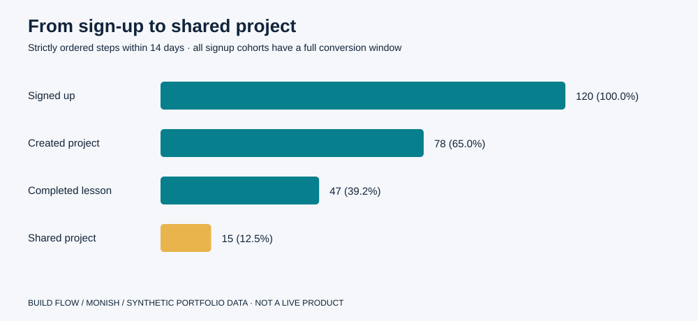
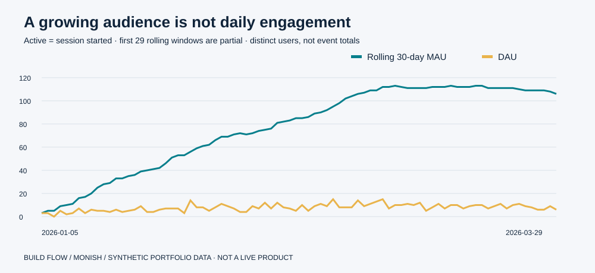
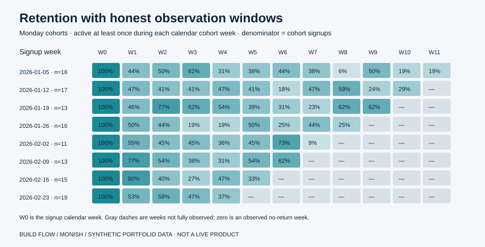

# Digital Product Analytics

**From reliable event data to a defensible product decision.**

BuildFlow is a fictional creative-learning product for adults. This portfolio project uses Python and SQL to understand activation, engagement, retention, and feature adoption, then turns the analysis into a product brief, user stories, RICE backlog, experiment proposal, and roadmap.

Built by **Monish**, connecting an Electrical Engineering background, three years in EAM/master data and data quality, and an MSc in Technology-Based Business Development with an interest in analytics and product management. This is independent portfolio work; it does not represent a company engagement or a deployed product.



## The business question

People can sign up without achieving a useful learning outcome. Where does the journey break down, which users struggle, and what should a product team validate next? The analytical challenge is to keep event counts separate from users, distinguish monthly windows, follow conversion steps in order, and avoid reporting future retention periods as zero.

## Results from the synthetic fixture

| Metric | Result | Interpretation |
|---|---:|---|
| Dataset | 120 adult users; 2,318 events | Seeded fictional activity over 84 days |
| 14-day activation | 78 / 120 = **65.0%** | Users creating a project after signup |
| Ordered lesson completion | 47 / 120 = **39.2%** | Signup, creation, completion within 14 days |
| Ordered sharing | 15 / 120 = **12.5%** | Final step of the same ordered funnel |
| Week-4 retention | 45 / 120 = **37.5%** | Cohort-size-weighted rate; fully observed weeks only |
| Collaboration adoption | 45 / 120 = **37.5%** | Full-window active users using that feature |

The largest count loss is before project creation (42 users). The lesson next-step checklist narrowly ranks first under the illustrative RICE assumptions because of its lower assumed effort; it is effectively tied with the guided starter. Discovery should validate both. These findings illustrate a decision process; the generator embeds behavioral differences and cannot establish demand or causal uplift. There is no claimed real-world business impact.

Read the [generated decision memo and roadmap](docs/decision-memo.md), [product vision and user stories](product/product-brief.md), or [ranked backlog](product/prioritized_backlog.csv).

## Reproduce in under a minute

Requires **Python 3.10+**. The pipeline uses Python's standard library, including SQLite; there are no third-party packages or service credentials.

```bash
git clone https://github.com/Monish-1010/digital-product-analytics.git
cd digital-product-analytics
python -m venv .venv
# Windows PowerShell: .venv\Scripts\Activate.ps1
# macOS/Linux: source .venv/bin/activate
python -m pip install -r requirements.txt
python run.py
python -m unittest discover -s tests -v
```

`run.py` regenerates the committed synthetic CSVs, SQL summaries, SVG charts, RICE backlog, and decision memo. The seed and observation dates are fixed in `src/pipeline.py`. No network access is needed after cloning. SQL is executed against an in-memory database and the results are exported to CSV.

## Analytical choices that matter

- **DAU** counts distinct users starting a session, with explicit zero-activity dates. **Calendar MAU** and **rolling 30-day MAU** are separate exports. Partial calendar months and incomplete rolling windows are flagged.
- **Activation funnel** searches for strictly ordered timestamps inside a half-open 14-day window. Users without full follow-up are excluded. Each step includes its count, dropout, and both conversion denominators.
- **Retention** uses Monday signup cohorts. Only complete calendar weeks are reported; unobserved cells stay blank. Week 0 is the signup calendar week, not seven elapsed days for each user.
- **Feature adoption** uses distinct active users as its denominator, not total events. Segment tables keep sample sizes visible.
- **Quality checks** enforce unique keys, event references, observation dates, metric bounds, monotonic funnels, and censoring. Six focused tests cover out-of-order events, exact conversion-window boundaries, insufficient follow-up, distinct counting, rolling-window expiry, and deterministic generation.

See the [data dictionary and limitations](docs/data-dictionary.md) for exact definitions.





## Review the project

```text
run.py                    One-command rebuild
src/pipeline.py           Deterministic simulation, validation, CSV/SVG generation
sql/metrics.sql           Activity, ordered funnel, retention, adoption, segmentation
data/raw/                 Synthetic users and events
data/processed/           Fact/dimension CSVs for reporting
results/                  Reproducible metrics and quality checks
images/                   Generated SVG figures
docs/                     Metric contract, decision memo, Power BI specification
product/                  Vision, personas, user stories, prioritized RICE backlog
tests/                    Boundary and semantic metric tests
```

Start with [SQL definitions](sql/metrics.sql), [summary CSV](results/summary.csv), or [per-user funnel timestamps](results/funnel_users.csv) to trace a number to its source.

## Power BI handoff

The [dashboard specification](docs/dashboard-spec.md) includes a star-schema model, relationships, DAX examples, page layouts, slicer limitations, and acceptance checks against the SQL outputs. No `.pbix` has been fabricated. The images in this README are directly generated analytical figures, not screenshots of a Power BI report.

## Data provenance and scope

All data are generated locally and represent fictional adults. No confidential employer, customer, university, municipal, LEGO, Vestas, or Siemens Gamesa data are used. No real participants were interviewed. Personas, effort estimates, impact scores, and proposed experiments are explicitly hypothetical. This small simulation excludes many production concerns such as consent infrastructure, identity merges, late events, and feature entitlements; the documentation explains those limits.

MIT license - see [LICENSE](LICENSE). More projects: [Monish-1010](https://github.com/Monish-1010).
